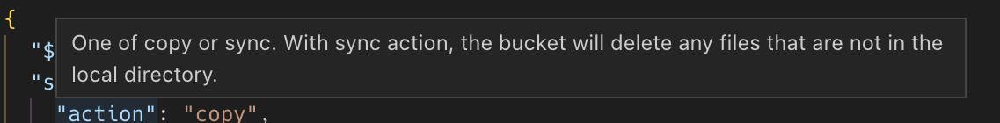

# 개발 관련

## GitHub API

GitHub API를 호출할 때는 반드시 `User-Agent` 헤더도 설정해야 한다.
Overview 항목 건너뛰고 바로 API 사용법 문서만 봤더니 저 내용을 못봐서  액세스 토큰은 문제없이 넣어줬는데도 계속 요청 거부가 되었다.
특별한 형식이 있는 것은 아니라서 일단 넣어주기만 하면 되는 모양이다.

*See Also: [GitHub 문서 User agent required](https://docs.github.com/en/rest/overview/resources-in-the-rest-api?apiVersion=2022-11-28#user-agent-required)*

## Preact는 IE11을 지원한다.

2023년 3월 15일 현재, 놀랍게도 불과 [5일 전에 릴리스된 Preact의 최신 버전](https://github.com/preactjs/preact/releases/tag/10.13.1)에서도 IE11을 '공식' 지원한다.

## 3사 쿠키 정책

웹 브라우저마다 3rd party 쿠키 정책이 다르다. 로컬 스토리지로 우회할 수 있을까 했는데 그것까지 잘 막아놨다(내가 생각할 정도니 당연한 건가). 메이저 브라우저 중 (광고 기업으로서는) 가장 불편한 게 Safari인 듯 한데 참 꼼꼼히 막아놨다. 심지어 로컬 스토리지는 부모 문서의 도메인에 따라 파편화도 된다. 자세한 내용은 https://www.cookiestatus.com/ 을 참조하자.

## GitHub Actions

- 워크플로우에서 보호된 브랜치에 푸시할 수 없다는 에러가 나타나는 경우가 있다. 이 때는 개인 토큰을 만들어서 checkout 액션을 실행할 때 설정해주면 된다. (설정 방법은 매뉴얼 참고)
- 마찬가지로 이메일 노출을 안하도록 설정한 `Keep my email addresses private` 설정이 켜져 있으면 에러가 발생하기도 한다. 이 때는 GitHub에서 제공하는 대체 이메일을 설정하면 된다.  `Settings > Emails > Primary email address`에서 찾을 수 있다.

## SQLite의 발음

분명 예전에 시퀄릿`/'si: kwəl/` 처럼 발음한다고 봤던 기억이 있다. 그래서 지금까지 꽤 오랫동안 그렇게 발음해왔다.
그러다 얼마 전 SQLite을 개발한 Richard Hipp이 Google Tech Talk에서 [강연하는 영상](https://youtu.be/giAMt8Tj-84?t=71)을 봤는데 "에스큐엘라이트"라고 발음했다.
오늘부터는 나도 그렇게 발음해야겠다.

## npm link

로컬에서 여러 노드 프로젝트를 개발할 때 `npm link`를 사용하면 로컬 변경사항이 바로 반영되서 편리하다.

## Copilot

언제부터인지 모르겠는데 Copilot이 커밋 메시지도 자동으로 완성해준다. (아마도) 영어를 더 잘 완성해줄테니 영어로 커밋 메시지를 써야겠다.

## JSON Schema

배포 설정을 JSON 형식으로 만들어 뒀는데 만에 하나를 대비해 형식에 제약을 걸어두고 싶었다.
그래서 JSON 파일 제일 위에 `$schema` 필드를 만들어서 스키마를 참조했다.
타입 스크립트를 사용하지 않은 이유는 젠킨스 배포 스크립트에서 JS를 공식적으로 지원하지 않아서(node는 기본 설치되어 있어서 어떻게든 되긴 하겠지만) 쉡 스크립트로만 최대한 가볍게 해결을 하고 싶었기 때문이다.
(다른 대안은 Groovy Script였는데 너무 어색해서 차라리 쉘 스크립트로 삽질하는 걸 선택)

생각보다 작성하기 쉬운 편이었고 로컬 파일 경로로도 잘 참조된다. 사내 프라이빗 패키지에 저장해서 배포해놓으니까 마음이 편안.
예상하지 못했던 장점 중 하나는 필드에 `description`을 추가할 수 있어서 필드 이름 위에 마우스 커서를 올리면 설명을 보여준다는 거다.



## GitHub Raw File

GitHub 개인용 토큰(personal access token, Token)을 `Accept: Bearer <token>` 헤더에 넣어서 요청하면 raw 파일을 다운로드할 수 있다. 공통 스크립트 파일을 배포할 때 사용함.

## Git 커밋 날짜

Git 커밋을 할 때 `--date` 설정을 사용하면 날짜를 현재 시각이 아닌 다른 날짜로 바꿀 수 있다. 예를 들어 `git commit --date="1 day ago"`로 하면 하루 전 날짜로 커밋을 할 수 있다. Git을 그렇게 오랜 시간 사용하면서 처음 알았네.

## Vite 빌드 오류

Vite로 Node.js CLI 애플리케이션을 만드는데 자꾸 `Error: 'constants' is not exported by "__vite-browser-external"` 이런 비슷한 형식의 오류가 발생한다.
오류가 발생한 부분의 코드는 다음과 같았다.

```
import { constants } from 'node:fs/promises';
```

에러의 원인은 Vite는 브라우저 환경에서 동작하는 것이 기본값이라 `node:`로 시작하는 Node 빌트인 패키지도 어떻게든 번들하려다가 발생하는 문제였다.
번들된 파일을 열어보면 결국 `node:fs/promises`는 빈 객체(`{}`)로 대체되고 따라서 `constants`는 `undefined`가 되어버린다.

의외로 해결책은 간단하다.

Vite로 하여금 노드 환경에서도 사용될 수 있다고 알려주면 되는 건데, 조금 엉뚱하지만 `build.ssr` 옵션을 `true`로 설정하면 된다. 그러면 문제 끝.

## JSON.stringify의 키 정렬

JSON을 문자열로 만들 때 키의 알파벳 순서로 정렬되기를 원해서 JSON에 건네주는 객체를 정렬된 키로 새로 만들어도 봤는데 잘 되지 않았다.
해결 방법은 `JSON.stringify`의 두 번째 인수로 정렬된 키의 배열을 전달하면 된다.
원래는 "허용된 키를 입력하는" 인수지만 정렬 용도로도 사용할 수 있었다.

```js
JSON.stringify(obj, Object.keys(obj).sort());
```

